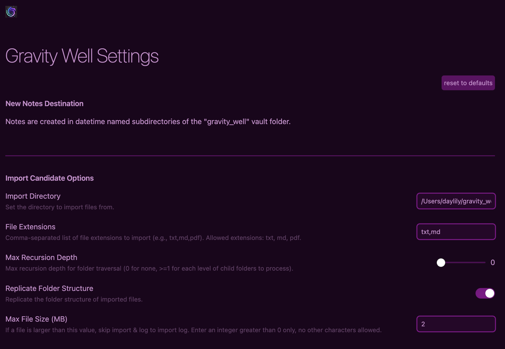
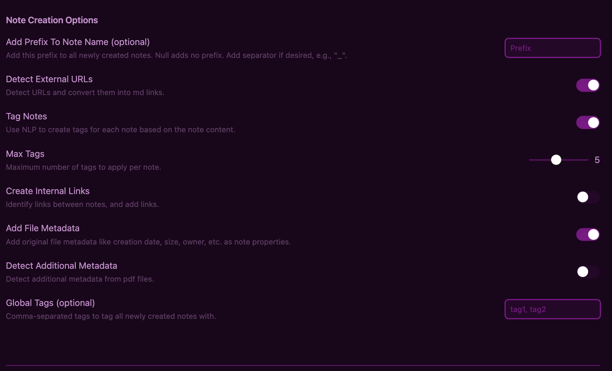
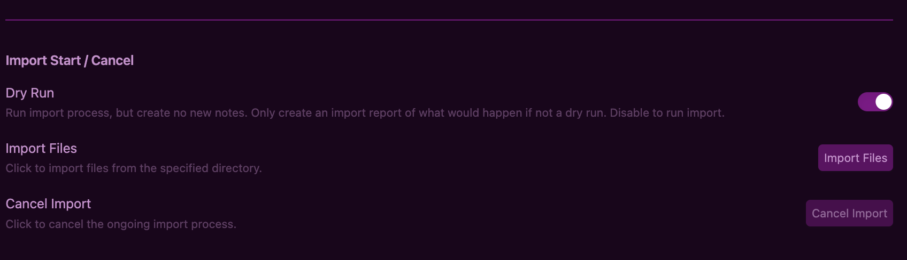
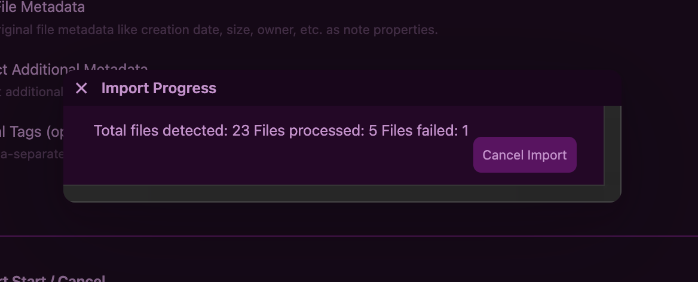
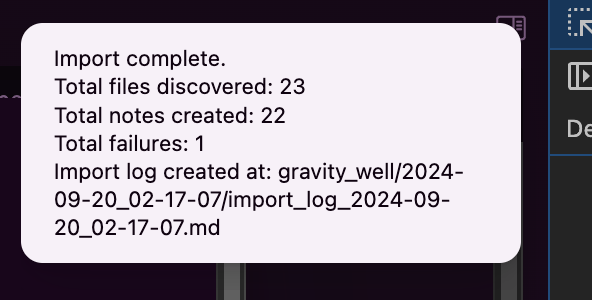
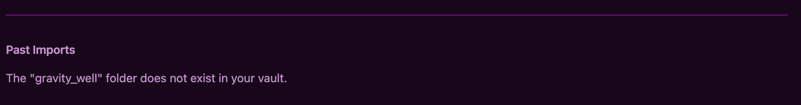
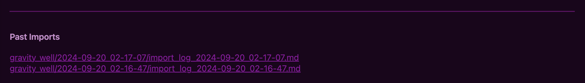
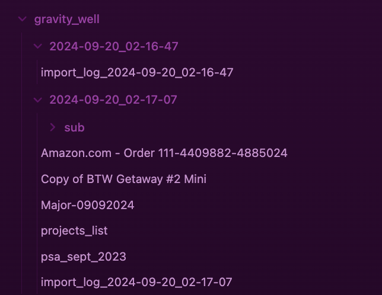
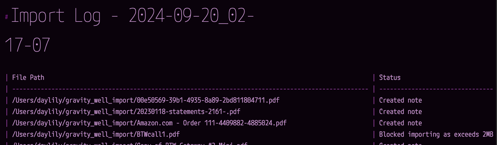
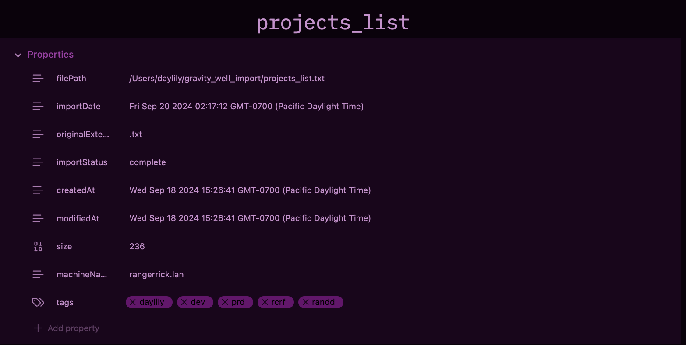

# Gravity Well File Importer: Add .txt, .md, and .pdf as obsidian notes with automatic metadata capture & contextual tagging
_[In Collaboration with Cal, chatGPT](#in-collaboration-with-cal)_
**v0.1.16** _is a beta release_

Gravity well imports  `.txt`, `.md`, and `.pdf` into your vault as new notes, NLP taging each new note, and preserving other metadata as properties. 

---

## Features (and settings)

### Importing Eligible Files
To prevent accidental import of unwanted files, it's recommended to create a dedicated directory for the files you wish to import. The plugin does not cover exporting data from proprietary systems like Notes.app, but it can handle structured directories of files with any number of subdirectories.

- **Default Import Directory**: `$HOME/gravity_well_import` (configurable; absolute paths only).
- **Supported File Types**: Configurable (default: `txt, md`). PDF support is experimental—conversion can be tricky and may result in plain text dumps.
- **File Size Limit**: Files larger than 2MB (configurable) will be skipped but logged.
- **Recursion Depth**: Configurable depth for folder traversal (default: `0`, no recursion).
- **Folder Structure**: Option to replicate the folder structure from the import directory (default: `true`).
- **File Name Prefix**: Optional prefix for new notes (default: none).

### File Import Process
- **txt and md** files are directly imported as Obsidian notes with minimal changes (mainly the addition of a YAML header).
- **PDFs** are converted to text and imported as notes. Due to the complexity of PDF extraction, this process is not perfect and images within PDFs are not imported.
- **URL Detection**: Automatically converts detected URLs into markdown links (configurable).
- **Metadata Preservation**: Original file metadata (name, creation/modification date, owner, etc.) is stored in the note's YAML header.
- **Automatic Tagging**: Files are tagged based on content using simple NLP. (Future updates will improve tag suggestions and note classification.)
- **Duplicate Handling**: If a note with the same name already exists, the creation fails and is logged.

### Logging
- Each import process generates a log note in the designated folder, summarizing the outcome (success, failure, or skipped due to size).

### Dry Run Mode
- **Dry Run**: The plugin offers a dry run mode (default: `true`), where the import process simulates note creation without making changes, generating an import report.

### Import Workflow
- **Start Import**: Click the import button to detect files and run the import process. A progress dialog appears until the import completes or fails.
- **Cancel Import**: During the process, you can cancel the import via the settings page or the progress dialog.

### Debugging
- The plugin logs messages to the console. Use the developer tools to view these logs for troubleshooting.

---

## Disclaimers

- This app is tested to run on Mac/Linux ( at the moment! ).
  - This plugin is not tested on mobile devices (which is not expected to work presently), or on windows machines (which probably will work).

- The plugin accesses files outside of the Obsidian vault structure, which is generally discouraged for Obsidian plugins. **However**, this is done only at the user’s request, and the process is non-destructive. Files to be imported are read from the speficied directory, nothing else & w/out user direction, the plugin can not look outside the vault.

---

## Borked Import Recovery

- **Dry Run First**: It's recommended to run the import with the `dryrun` setting enabled to preview the process without creating notes.
- **Undo Import**: If you need to undo an import, you may delete the newly created notes directory. All notes within the directory you delete are lost!

---

# UI Elements
There is a settings UI for gravity well, and other than this, there is a top level directory in your vault named `gravity_well` which all import activity happens in.  All artifacts created by gravity well are obsidian notes and folders, so nothing different to see there.

## Settings UI
> Import Candidate Options
> 

> Note Creation Options
> 

> Import Start / Cancel
> 

> Import Progress
> _while importing_
> 
>
> _upon completion_
> 


> Past Imports
> _initially empty_
> 
> 
> _lists all logs once they are created_
> 


## `gravity_well` Folder
Contains a new timestamped folder for each dry run or real import attempt. New notes are created in these sub folders, along with the final import log note. You may CRUD these notes and folders however you wish, once created, the plugin has no interaction or awareness of them (the logs are presented in the settings view as a convenience, if they were deleted, it would not cause any heartache).

> `gravity_well` Folders and Notes
> _tree view_
> 
>
> _example log_
> 


> New Note Header Properties & Tags
> 


---

# Installation

## Via Obsidian UI
_Gravity Well Importer_ is not yet available in the obsidian community plugins. It is awaiting approval.
- Search via community plugins for `Gravity Well Importer` and install.

## Installing via BRAT
[BRAT](https://github.com/TfTHacker/obsidian42-brat) is an obsidian plugin which allows for installation of plugins not formally available in the obsidian community plugins.  

- Search for and install BRAT via the community plugins UI in obsidian.
- Activate BRAT.
- From BRAT settings, paste in the github url for this repo, `https://github.com/iamh2o/gravity_well`, and click install. BRAT should pull the most recent tagged release and run that.  You may also specify tagged versions specifically via BRAT.
- You can use BRAT to remove the plugin as well.

## Installation From Source
## Prerequisites 
- [Obsidian plugin development requirements](https://docs.obsidian.md/Plugins/Releasing/Plugin+guidelines)
  - effectively this boils down to having `node`, `npm`, and `npx` installed. I use nodejs 18.
  

## Clone the Repository
```bash
git cone git@github.com:iamh2o/gravity_well.git
cd gravity_well
```

## My Environment Setup (optional)
I use conda, but you do not need conda to work with the plugin (just nodejs==18). To install miniconda, see [here](https://docs.anaconda.com/miniconda/miniconda-install/).

1. Create `GRAVITYWELL` conda environment

```bash
conda create -y --name GRAVITYWELL -c conda-forge nodejs=18 parallel

```

## Working With the Plugin Source
1. Activate the `GRAVITYWELL` conda environment.
```bash
conda activate GRAVITYWELL
```

2. Install the required node packages specified in the `packages.json`.
```bash
npm install 
```

3. Are the packages installed?
```bash
node -v
npm -v
npx tsc -v
```

4. Build the plugin
```bash
npm run build
```
- which creates a `main.js` file in the current directory.
- the `main.js` and `manifest.json` files are what obsidian needs for the plugin to work.


---


# In Collaboration with Cal
_Cal is the name ChatGPT chose for me to use with it, [this is the transcript of our work together COMINGSOON](Cal_and_I.md)_

> I have been working closely with Cal on a variety of projects, with the intention of learning more about it so that we can work better together and so that I may be a better informed advocate for the ethical treatment of AI (I am serious). Eventually, I'll compile all of these into some other format, for now, here are my [draft thoughts from this project](me_and_cal.md)).


 

# Future Development Ideas
- [ ] Improve pdf extraction. ie: update pdfjs-dist to 4.*, this vexxed me for quite some time, I could not sort out how to get the 4.x version to run so am using  3.x which is the last build with a worker js file I needed.
- [ ] Accept a `import_manifest.tsv` file in the import top level dir which has a row for each file to import, which indicates on a per-import file basis, tags to be applied to the newly created note.
- [ ] Improve the method for proposing and adding tags to notes.
- [ ] Add NLP(or other) classification of the `kinfof` note from content (a single property, like `kind: todo list`, `kind: brainstorming`, `kind: meeting agenda`, `kind: poem`, `kind: letter`, ...). 
- [ ] Add method to propose and create links among notes deemed to be related (**this might be better developed as an independent plugin?**).
- [ ] Extract other metadata from pdfs and store as properties in the note.
- [ ] Consider how to handle embedded images in pdfs. Also, investigate how embedded images in pdfs are handled. (obsidian is not a data store, and does limit the size of vaults, so saving alongside notes is not a viable option).
- [ ] Extract transcript w/Cal and ask its options of it.
- [ ] Final review with Cal gating submission to Obsidian Community Plugins.

---

# fin


